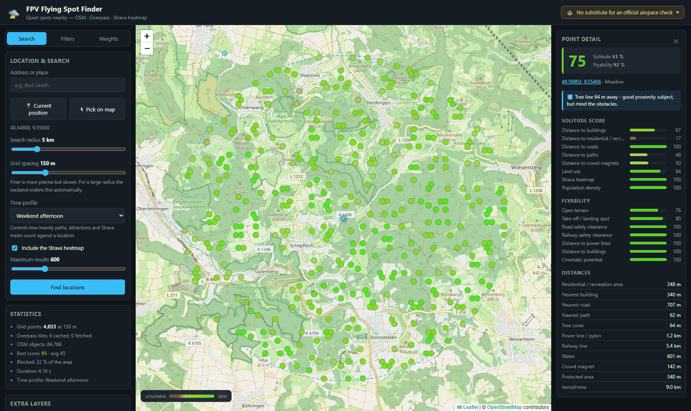

# FPV Flying Spot Finder

[fpv-finder.com](https://fpv-finder.com)

Finds places within a chosen radius where few people are about and the flying is
good, using OpenStreetMap and the Strava heatmap. No accounts, no ads, no API keys.



> ⚖️ **Not a substitute for an airspace check.** The scoring is a heuristic over
> incomplete open data, offered with no warranty. Verify the EU drone regulation
> (2019/947), your national rules, NOTAMs and geographical UAS zones yourself
> before every flight — in Germany via [dipul.de](https://www.dipul.de/) or the
> [DFS UAS map](https://maptool-uas.dfs.de/).

## Run it

[Clone Github Repository](https://github.com/layer0180/fpvfinder)

```bash
docker run -d -p 8000:8000 \
  -v fpvfinder-data:/app/backend/data \
  -v fpvfinder-config:/app/backend/config \
  ghcr.io/layer0180/fpvfinder:latest
```

Then open <http://localhost:8000>. `docker compose up -d` does the same; copy
[`.env.example`](.env.example) to `.env` first to set your own domain.

From source, in two terminals:

```powershell
.\start-backend.ps1     # FastAPI on :8000
.\start-frontend.ps1    # Vite on :5173
```

## Configure

Every weight and threshold lives in `backend/config/weights.json` — editable in
the "Weights" tab or directly in the file. Everything else is environment
variables, documented in [`backend/.env.example`](backend/.env.example).

Putting it online: set `PUBLIC_MODE=true`, which disables the endpoints that
change server-wide state, and size `MAX_RADIUS_KM` to the machine — memory grows
with the square of the radius, roughly 240 MiB at 5 km and 1 GiB at 10 km.

## Support

Hosting costs a little. If the tool is useful to you:
[buy me a coffee](https://buymeacoffee.com/layer0180). Entirely optional —
nothing is gated behind it.

## Licence

[AGPL-3.0](LICENSE). Because this is served over a network, § 13 also requires
anyone running a *modified* version to offer its source to the people using it.

Map data © OpenStreetMap contributors, licensed under the
[ODbL](https://www.openstreetmap.org/copyright) — that attribution is required
and has to stay.
